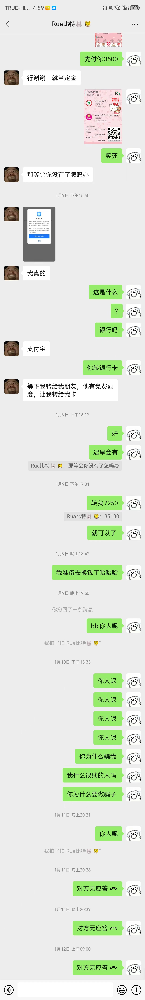
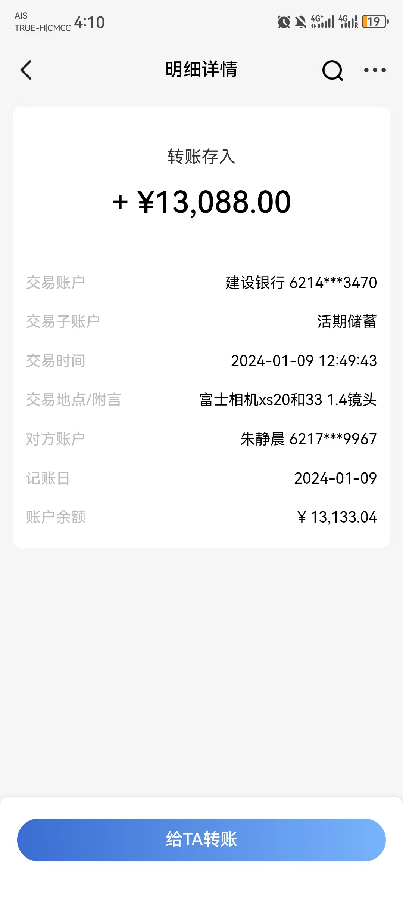
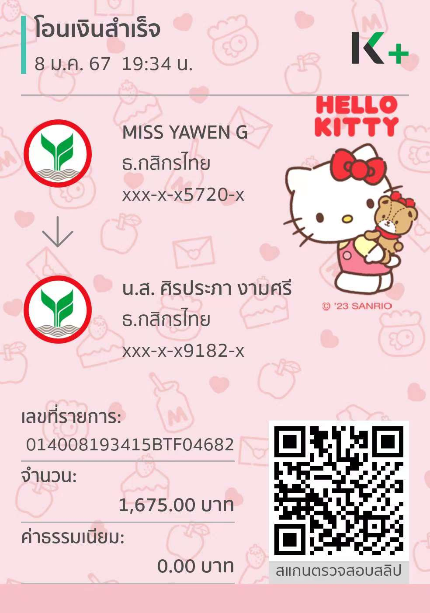
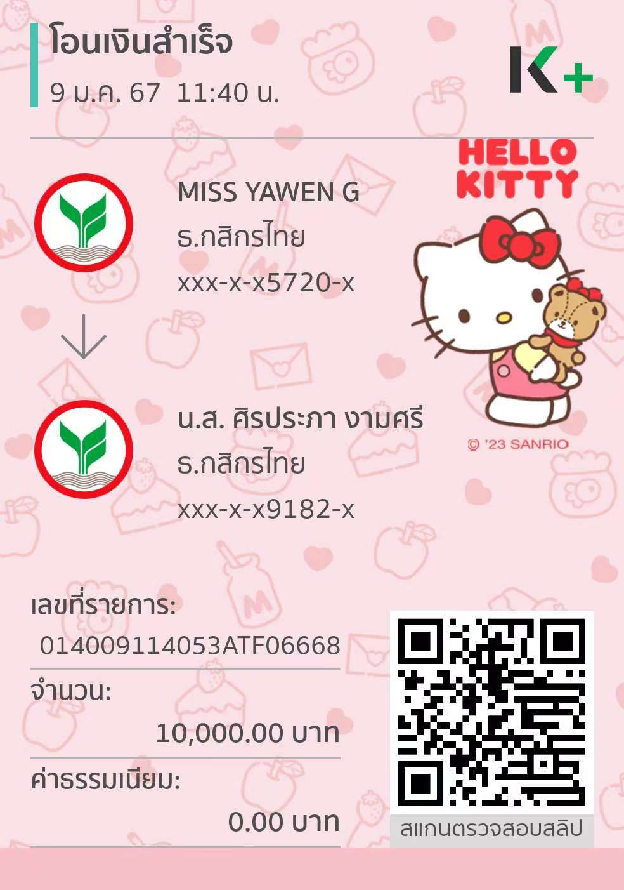
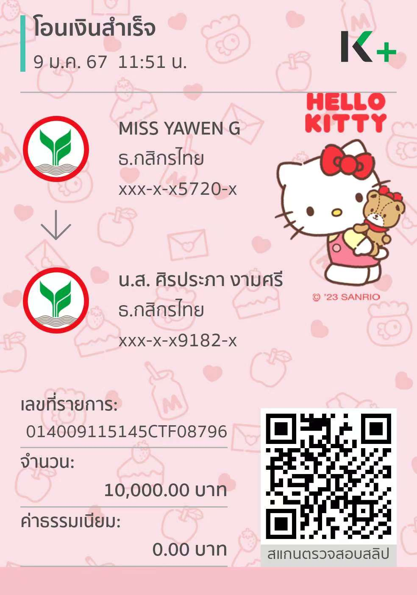
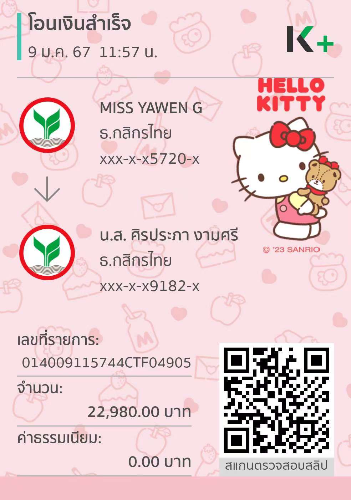
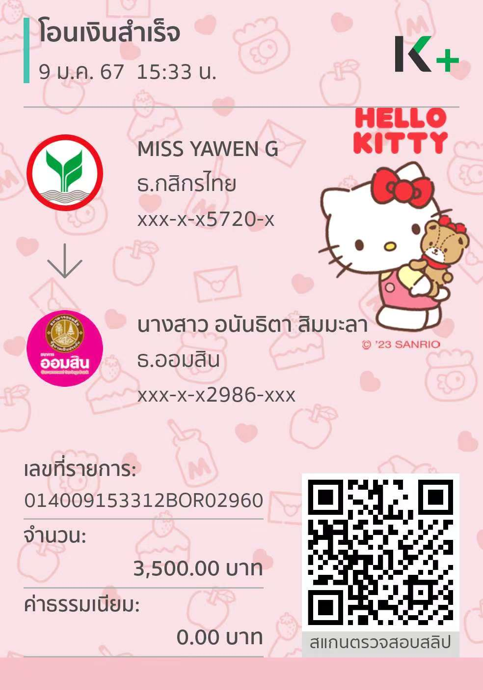

典型的ABC骗局，换汇、代付一直是境外诈骗重灾区。

简单来说，B促成A和C之间的换汇或代付交易，B先让A给C付钱，然后B让C付另外一种货币给自己，B收到钱之后跑路。

之后的剧情，一般是A拿起法律武器告C，尝试获得部分或者全额赔偿。当然也有别的变种，比如线下交易，都是涉及几百万人民币金额的局。以后再细说。

朋友遇到的事，我先放弃个人立场，把每个人的说法描述一遍。

* A: 朱静晨，在国内。下面简称A。
* B: 不知道真实身份，微信名 Rua比特。下面简称B。
* C：朋友 Yawen，在泰国工作。下面简称C。

C跟B换汇，C收人民币出泰铢，约定汇率 4.8。由于前面两笔，都是B先付人民币，C没有细问来源，收到人民币之后转出泰铢。第一笔人民币于1月8日晚，转至C的支付宝，第二笔于1月9日中午，转至C的建行卡。两笔人民币都在A的户名下。1月9日下午，B希望C帮忙继续大夫3万多泰铢，然后给C发一个支付宝被限额的截图，暗示让C先付泰铢。由于C太穷泰铢不够，只付了3500泰铢。随后B失联。B在最后骗泰铢之前，还专门问C泰语水平如何，我猜目的是担心C发现被骗之后马上在泰国报警，通过B用的泰铢卡卡主获得B的真实身份。

1月10号凌晨1点，A主动联系C，说被骗，已经报案。随后C的银行卡被冻结，C户籍所在地警察也联系上了C，催促其回国说明情况。

C于2月4号回国。2月3号我见了C一面，然后带她去Thonglor警察局立案。立案主要目的是证明C在泰国有积极处理此事，另外有报案纸，方便去银行查询B用的泰铢卡卡主信息，尝试找出些线索。报案时，我用C的手机跟A聊天，希望A提供其与B的聊天记录，A的回复比较抵触。

接下来是我的一些私货。类似这种ABC骗局，A的身份都很可疑。因为A在交易时的表现像是傻白甜，意识到被骗之后，能马上去立案并冻结收款卡。

就我朋友这件事，我下疑点。

* A自称和B在小红书上认识十多天后，开始交易。A于1月8日发帖求购相机镜头。1月8号当天付了跑腿费，9号付镜头全款。为什么A会信任B，在没有任何交易保障的情况下，给B转1万多人民币。
* 事后A又在小红书上发帖称被骗。我留言贼喊捉贼之后，A为何删帖。

A在朋友圈3天可见。但是置顶中发了些23年十一假期在泰国玩的照片，以及其在湖南怀化市烟草局工作的照片。希望大家帮忙查一下朱静晨的工作是否真实。

